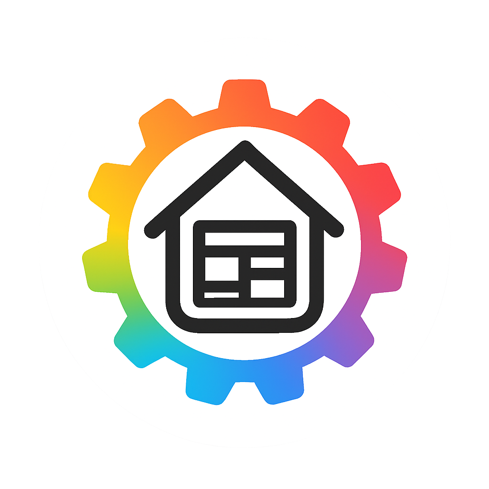

# 

# homedash-rs

Simple and straightforward dashboard for your homelab.  
Powered by Rust and built with [Tuono](https://github.com/tuono-labs/tuono) in mind.

> [!IMPORTANT]  
> This project is still under heavy development and is not ready for production use.

## Supported apps

- [x] AdGuard Home
- [x] Dockwatch
- [x] Overseerr
- [x] Plex
- [x] Prowlarr
- [x] Proxmox
- [x] qBittorrent
- [x] Radarr
- [x] Sonarr
- [x] Tautulli
- [x] TMDB
- [x] TVDB
- [x] HTTP Status

**Limitations**

- Data cards can not be moved or resized.
- Grid layout is hardcoded and can not be changed.
- **If you'd like to tackle any of these limitations, feel free to open a PR!**

# Screenshots


# Installation

Simplest way to deploy homedash-rs is to use Docker.  
Example `docker-compose.yml`:

```yaml
services:
    homedash-rs:
        container_name: homedash-rs
        network_mode: host
        environment:
            - PUID=1000 # Replace with your user ID
            - PGID=1000 # Replace with your group ID
            - TZ=Europe/Berlin # Replace with your timezone
        volumes:
            - ./data:/app/data # Replace with your data directory
        restart: unless-stopped
        image: ghcr.io/nzxl101/homedash-rs:latest
```

It's recommended to run homedash-rs on the same machine as your apps and use `network_mode: host`.

# Contributing

Feel free to open an issue or a PR if you'd like to contribute.
I'm happy to integrate any new features or bug fixes.

# Development

## Prerequisites

- cargo 1.85.1 or newer
- nodejs v20.15.0 or newer

## Run development server

```bash
git clone https://github.com/nzxl101/homedash-rs.git
cargo install tuono@0.19.7
pnpm i --frozen-lockfile
pnpm build
pnpm dev
```

# License

MIT License

Copyright (c) 2025 nzxl.space
